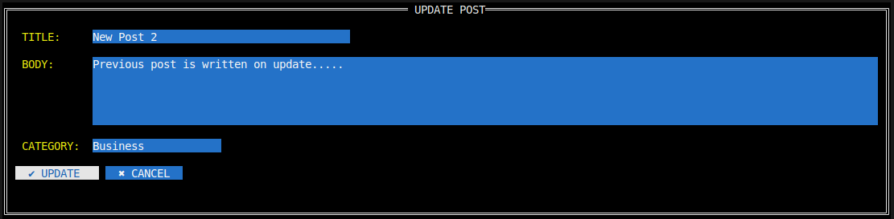
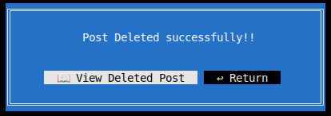
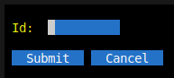
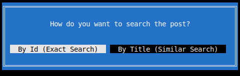
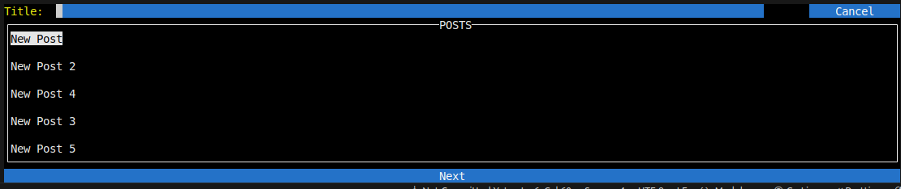

# 🚀 [Pblog](https://github.com/KAwasthi2889/PBlog) - A Dockerised TUI Blogging App  

Pblog is a **terminal-based user interface (TUI) blogging application** designed for seamless blog management. It enables users to **create, read, update, and delete posts** efficiently while supporting **similarity-based search** and **paginated fetching** to optimize performance and prevent database overload.  

## ✨ Features  

### **CRUD Operations** – Manage Your Blog with Ease  
Pblog provides a simple and intuitive way to handle blog posts.  

- **Create a Post** 📝  
  Effortlessly add new blog entries.  
  

- **Read a Post** 📖  
  View detailed content with ease.  
    

- **Update a Post** ✏️  
  Automatically pre-fills previous content for quick editing.  
    

- **CRUD with Confirmation** ✅  
  A confirmation of work done.  
    

- **Error Handling** ⚠️  
  Robust validation and user-friendly error messages.  
    

### 🔍 **Advanced Search Capabilities**  
- **ID-Based Search** 🔢  
  Retrieve posts using a unique identifier.  
    

- **Similarity-Based Search** 🧐  
  Find posts based on content relevance.  
    

- **Paginated Fetching** 📌  
  Optimizes performance by fetching posts in batches.  
    

## 🛠️ Installation & Usage  

1. 📥 **Clone the Repository**  
   ```bash
   git clone https://github.com/KAwasthi2889/PBlog
   ```
2. 📂 Navigate into the project directory and create a `db` directory:
   ```bash
   cd PBlog
   mkdir db
   ```
3. 📝 Inside the `db` directory, create a file named `database.env` and add the following environment variables:
   ```
   POSTGRES_USER=<your preferred user name>
   POSTGRES_PASSWORD=<your preferred password>
   POSTGRES_DB=<your preferred db name>
   ```
   ⚠️ **Note**: Ensure there are no spaces around the `=` sign.

4. 🚀 Start the application using Docker:
   ```bash
   docker compose up -d && docker attach tui-app && docker compose down
   ```

✅ And you are good to go! 😃

## 📢  Future Enhancements
- 🎯 **Search Filtering**: Filter search results through categories.
- 🔐 **Authentication**: Implement login and write permissions.
- 🏷️ **User Preferences**: Posts will be recommended based on user preference tags.
- 💰 **Payment Gateway**: Enable monetization options.
- 🏗️ **PostgreSQL Deployment**: Deploy a PostgreSQL instance on a server for public access.
